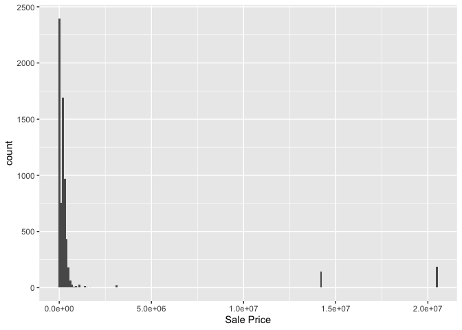
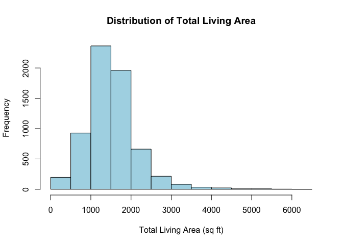
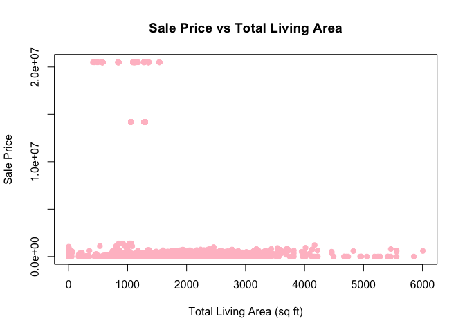
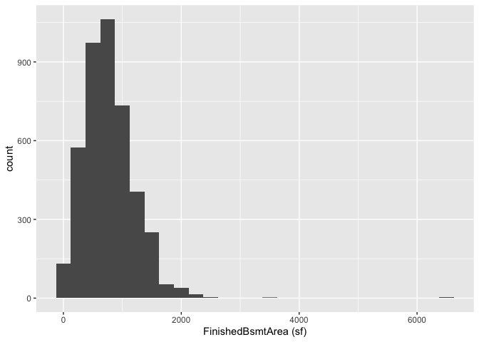
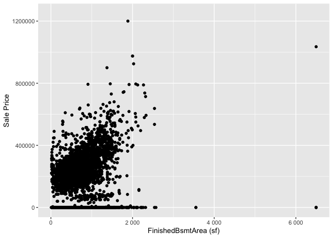

<!-- README.md is generated from README.Rmd. Please edit the README.Rmd file -->

# Lab report \#1

Follow the instructions posted at
<https://ds202-at-isu.github.io/labs.html> for the lab assignment. The
work is meant to be finished during the lab time, but you have time
until Monday evening to polish things.

Include your answers in this document (Rmd file). Make sure that it
knits properly (into the md file). Upload both the Rmd and the md file
to your repository.

All submissions to the github repo will be automatically uploaded for
grading once the due date is passed. Submit a link to your repository on
Canvas (only one submission per team) to signal to the instructors that
you are done with your submission.

## Step 1 Result

``` r
library(classdata)
str(ames)
```

    ## Classes 'tbl_df', 'tbl' and 'data.frame':    6935 obs. of  16 variables:
    ##  $ Parcel ID            : chr  "0903202160" "0907428215" "0909428070" "0923203160" ...
    ##  $ Address              : chr  "1024 RIDGEWOOD AVE, AMES" "4503 TWAIN CIR UNIT 105, AMES" "2030 MCCARTHY RD, AMES" "3404 EMERALD DR, AMES" ...
    ##  $ Style                : Factor w/ 12 levels "1 1/2 Story Brick",..: 2 5 5 5 NA 9 5 5 5 5 ...
    ##  $ Occupancy            : Factor w/ 5 levels "Condominium",..: 2 1 2 3 NA 2 2 1 2 2 ...
    ##  $ Sale Date            : Date, format: "2022-08-12" "2022-08-04" ...
    ##  $ Sale Price           : num  181900 127100 0 245000 449664 ...
    ##  $ Multi Sale           : chr  NA NA NA NA ...
    ##  $ YearBuilt            : num  1940 2006 1951 1997 NA ...
    ##  $ Acres                : num  0.109 0.027 0.321 0.103 0.287 0.494 0.172 0.023 0.285 0.172 ...
    ##  $ TotalLivingArea (sf) : num  1030 771 1456 1289 NA ...
    ##  $ Bedrooms             : num  2 1 3 4 NA 4 5 1 3 4 ...
    ##  $ FinishedBsmtArea (sf): num  NA NA 1261 890 NA ...
    ##  $ LotArea(sf)          : num  4740 1181 14000 4500 12493 ...
    ##  $ AC                   : chr  "Yes" "Yes" "Yes" "Yes" ...
    ##  $ FirePlace            : chr  "Yes" "No" "No" "No" ...
    ##  $ Neighborhood         : Factor w/ 42 levels "(0) None","(13) Apts: Campus",..: 15 40 19 18 6 24 14 40 13 23 ...

``` r
#?ames
```

Variables in ames dataset:

Parcel ID: character with ID (int) Address: property address (str)
Style: factor variable in type of housing (str) Occupancy: factor
variable in type of housing (str) Sale Date: date of sale (date) Sale
Price: sales price (int) Multi Sale: was this sale part of a package?
(bool) YearBuilt: year in which house was built (int) Acres: acres of
the lot (double) TotalLivingArea (sf): total living area in square feet
(int) Bedrooms: num of bedrooms (int) FinishedBsmtArea (sf): total area
of finished basement (int) LotArea (sf): total lot area (int) AC: does
the property have AC? (bool) FirePlace: does the property have a
fireplace? (bool) Neighborhood: factor variable to indicate neighborhood
(str)

## Step 2 Result

Main variable: Sale Price. We will focus on this variable.

## Step 3 Result

``` r
data(ames)
range(ames$`Sale Price`)
```

    ## [1]        0 20500000

``` r
library(ggplot2)
ggplot(ames, aes(x = `Sale Price`)) +
  geom_histogram(binwidth = 100000, position="stack")
```

<!-- -->

The histogram shows that most of the data is concentrated on the left
side of the graph, with some outliers on the right side. This shows that
the distribution of Sale Price is not uniform.

## Step 4 Result

### Chaitanya’s Work:

``` r
# range
range(ames$`TotalLivingArea (sf)`, na.rm = TRUE)
```

    ## [1]    0 6007

``` r
# histogram
hist(ames$`TotalLivingArea (sf)`,
     main = "Distribution of Total Living Area",
     xlab = "Total Living Area (sq ft)",
     col = "lightblue")
```

<!-- -->

``` r
# scatterplot with Sale Price
plot(ames$`TotalLivingArea (sf)`, ames$`Sale Price`,
     main = "Sale Price vs Total Living Area",
     xlab = "Total Living Area (sq ft)",
     ylab = "Sale Price",
     pch = 19,
     col = "pink")
```

<!-- --> Summary: The
variable TotalLivingArea (sf) represents the total living space of a
house in square feet. The values range from about 0 to around 6000
square feet. The histogram shows that most houses have living areas
between 1000 and 2000 square feet, with fewer houses having very large
living areas. The distribution is slightly right-skewed because a small
number of houses have much larger living areas.

The scatterplot comparing TotalLivingArea and Sale Price does not show a
clear positive trend because many houses have a Sale Price of 0, which
creates a horizontal cluster of points near the bottom of the plot.
These values are likely missing or incorrect data entries, which makes
the relationship harder to see. If those values were removed, we would
expect larger houses to generally have higher sale prices.

### Kalyna’s Work:

``` r
data(ames)
#Range
range(ames$`FinishedBsmtArea (sf)`)
```

    ## [1] NA NA

``` r
library(ggplot2)
#Histogram distribution
ggplot(ames, aes(x = `FinishedBsmtArea (sf)`)) +
geom_histogram(binwidth = 250)
```

    ## Warning: Removed 2682 rows containing non-finite outside the scale range
    ## (`stat_bin()`).

<!-- -->

``` r
#Scatterplot comparison
ggplot(ames, aes(x = `FinishedBsmtArea (sf)`, y = `Sale Price`)) +
geom_point() +
scale_x_continuous(labels = scales::label_number(accuracy = 1)) +
scale_y_continuous(labels = scales::label_number(accuracy = 1)) +
scale_y_continuous(limits = c(0, 1250000))
```

    ## Scale for y is already present.
    ## Adding another scale for y, which will replace the existing scale.

    ## Warning: Removed 2682 rows containing missing values or values outside the scale range
    ## (`geom_point()`).

<!-- --> Summary: The
variable FinishedBsmtArea (sf) shows the square footage of the basements
of each home. The histogram distribution shows a peak at around 1000
sqare feet, with a few outliers around the 3500 and 6500 marks. The
scatterplot shows that the two variables have a moderate positive
correlation. There are a few noticeable outliers, and a “floor” of
points, since many of the houses are listed at a sale price of 0.

### Mariana’s Work:

``` r
sum(ames$YearBuilt == 0, na.rm = TRUE)
```

    ## [1] 1

``` r
range(ames$`YearBuilt`, na.rm = TRUE)
```

    ## [1]    0 2022

``` r
library(dplyr)
```

    ## 
    ## Attaching package: 'dplyr'

    ## The following objects are masked from 'package:stats':
    ## 
    ##     filter, lag

    ## The following objects are masked from 'package:base':
    ## 
    ##     intersect, setdiff, setequal, union

``` r
ames_clean <- ames %>% filter(YearBuilt > 0)
range(ames_clean$YearBuilt)
```

    ## [1] 1880 2022

``` r
ggplot(ames, aes(x = `YearBuilt`)) +
  geom_histogram(binwidth = 5, position="stack") +
  coord_cartesian(xlim = c(1880, 2022))
```

    ## Warning: Removed 447 rows containing non-finite outside the scale range
    ## (`stat_bin()`).

<!-- -->

It looks like there are more houses built on the second half of the
range of the graph (1960-2022). It shows an average increase throughout
the years.

``` r
ggplot(ames_clean, aes(x = YearBuilt, y = `Sale Price`)) +
  geom_point() +
  labs(title = "Sales Price by Year")
```

<!-- -->

To better see the relationship, I adjusted the Sale Price axis.

``` r
ggplot(ames_clean, aes(x = YearBuilt, y = `Sale Price`)) +
  geom_point() +
  coord_cartesian(ylim = c(0, 750000))
```

<!-- -->

Generally, it seems like sales price increases with the year the house
is built. So new houses in Ames generally have higher sale prices. The
oddities seen in step 3 can be seen in the first plot, as some outlier
values are seen for very high sale prices. These outliers are around
year 2000, following the trend that newer houses usually have higher
sale prices.

### Sebastian’s Work:

I choose to work with the variable ‘LotArea(sf)’.

``` r
library(ggplot2)
# Range
range(ames$`LotArea(sf)`, na.rm = TRUE)
```

    ## [1]      0 523228

``` r
# Histogram
ggplot(ames, aes(x = `LotArea(sf)`)) +
  geom_histogram(binwidth = 30, position="stack") +
  coord_cartesian(xlim = c(0, 50000))
```

    ## Warning: Removed 89 rows containing non-finite outside the scale range
    ## (`stat_bin()`).

-1.png)<!-- -->

``` r
# Scatterplot with Sale Price
ggplot(ames, aes(x = `LotArea(sf)`, y = `Sale Price`)) +
geom_point() +
scale_x_continuous(labels = scales::label_number(accuracy = 1)) +
scale_y_continuous(labels = scales::label_number(accuracy = 1)) +
scale_y_continuous(limits = c(0, 750000))
```

    ## Scale for y is already present.
    ## Adding another scale for y, which will replace the existing scale.

    ## Warning: Removed 489 rows containing missing values or values outside the scale range
    ## (`geom_point()`).

-2.png)<!-- -->

Summary: LotArea(sf) represents the total horizontal surface area within
a property’s boundary lines in Ames, measured in square feet. The values
range from about 0 to around 6000 square feet. The histogram shows that
the vast majority of lot areas for homes in Ames are around 10000 (or
less) square feet, with much fewer houses having very large lot areas
(\>3000 sq ft). The distribution is right-skewed because of how little
the number of houses with larger lot areas compare to those with lot
areas around 10000 sq ft, which are concentrated to the left of the
histogram.

The scatterplot highlights how there are not many outliers in the first
place, but there are a few with extremely large lot areas (a few
measured between 200000 and 600000 sq ft, which are several acres of
land).
